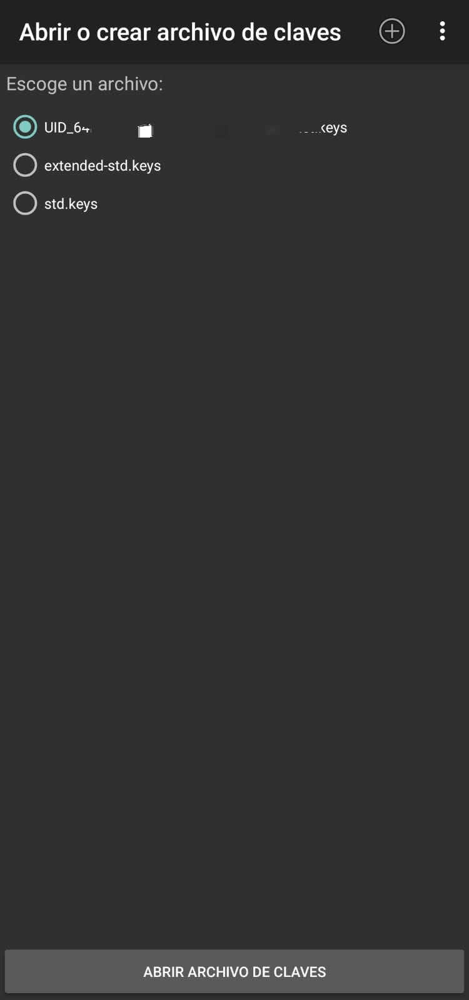

# NFC vs RFID

## ¿Que es NFC?
*Comunicacion de campo cercano*, es una tecnonologia de comunicacion inalambrica, de corto alcance y alta frecuencia que permite el intercambio de datos entre dispositivos. Todo estandar se encuentra recogido en la ISO 14443.

**Funcionamiento**

NFC se comunica mediante induccion en un campo magnetico, en donde dos antenas de espiral son colocadas dentro de sus respectivos campos cercanos. Trabaja en la banda de los 13,56MHz, haciendo que no se aplique ninguna restriccion y no requiera de licencia para su uso.

Soporta dos modos de funcionamiento:
 - Activo, ambos dispositivos generan su propio campo electromagnetico, que utilizara para transmitir sus datos.
 - Pasivo, solo un dispositivo generara el campo electromagnetico y el otro se aprovecha de la modulacion de la carga para poder transferir los datos.

## ¿Que es RFID?
*Identificacion por radiofrecuencia*, es un sistema de almacenamiento y recuperacion de datos remotos que usa dispositivos *tags* o tarjetas.Trabaja en la banda 125KHz, su proposito es transmitir la entidad de un objeto mediante ondas de radio.

**Funcionamiento**

El modo de funcionamiento de los sistemas RFID es simple. La etiqueta RFID contiene los datos de identificacion unico que se encuentra adherido al objeto, genera una señal de radiofrecuencia con dichos datos. Esta señal puede ser captada con un lector especifico, el cual se encarga de leer la informacion y pasarla en formato digital a la aplicacion especifica que utiliza el RFID666.

La tecnologia RFID consta de la siguientes partes:
- Etiqueta RFID,compuesta por una antena, un tranductor radio y un chip. El proposito de la antena es permitirle al chip, transmitir la informacion contenida. Estas etiquetas a su vez se diciden segun su rol:
  - Solo lectura
  - De lectura y escritura
  - Anticolision
- Lector RFID, compuesto por una antena, un transceptor y un decofdificador. El lector envia periodicamente señales para ver si hay alguna etiqueta en sus inmediaciones. Esta extrae la informacion y se pasa a un subsistema de procesamiento de datos.
- Middleware RFID, proporciona los medios de proceso y almacenamiento de datos.

>_Fuente Wikipedia [NFC](https://es.wikipedia.org/wiki/Comunicaci%C3%B3n_de_campo_cercano) y [RFID](https://es.wikipedia.org/wiki/RFID)  
Consultado el 28/09/2022_
---

## HACKING ETICO

Ahora en el siguiente articulo se aplicaran ejemplos de uso y algunos tipicos ataques sobre tarjetas NFC/RFID. Para ello has de tener una tarjeta y dispositivo movil que incluya tecnologia NFC. Y en el accederemos a la Play Store para descargarnos la siguiente aplicacion.

https://play.google.com/store/apps/details?id=de.syss.MifareClassicTool

**MIFARE Classic Tool**

Es una simple aplicacion para leer, escribir y analizar etiquetas NFC/RFID.

Una vez descargado iniciaremos la aplicacion y nos encontraremos con el siguiente menu:

En ella podemos ver un total de 6 opciones:
 - Leer etiqueta
   - Las etiquetas o tarjetas para ser leidas, primero debemos de conocer sus claves A y B. La aplicacion contiene dos ficherosque actuan como diccionario de claves estandar. En caso de ni conseguir mapear una de las dos claves, la aplicacion omitira la lectura de dicho sector.

 - Esribir etiqueta
   - Una vez leida nuestra tarjeta o etiqueta, podemos modificar cada uno de los sectores y bloques que lo componen, modificando la integridad de sus datos a nuestra necesidad.

 - Editar/Analizar dumpeo
   - Sirve como editor de cualquier etiqueta o tarjeta que hayamos guardado

 - Editar/Analizar archivo de claves
   - Una vez crackeado las claves de nuestra tarjeta se guardara en un fichero de clave, para su proxima vez y no tener que volver a mapear cada clave desde 0

 - Herramientas, nos ofrece una serie de utilidades para el manejo de datos e informacion
   - Mostrar informacion de la etiqueta
   - Clone UID
   - Compare Dumps
   - De/codificador de condiciones de acceso
   - De/codificador de Value Block
   - BCC Calculator (Block Check Character)
   - Convert Data
   - UID Log
   - Gestor de archivos
 - Ayuda e info  

### Metodos de Ataque  
- **Darkside attack**  
  Este ataque es factible en caso de no conocer ninguna clave de la tarjeta en cuestion, es decir, cuando no hemos podido leer ningun solo sector.  
  Basicamente trata de explotar un debilidad en el cifrado.

- **Hardnested Attack**  
  Este ataque explota la vulnerbilidad criptografica de CRYPTO1 y al igual que Nested, necesita de al menos del conocimineto unas del par de claves.

- **Clonado**  
  Como su nombre indica es el proceso de volcado de datos contenidos en una tarjeta a otra mediante metodo de espejo.    